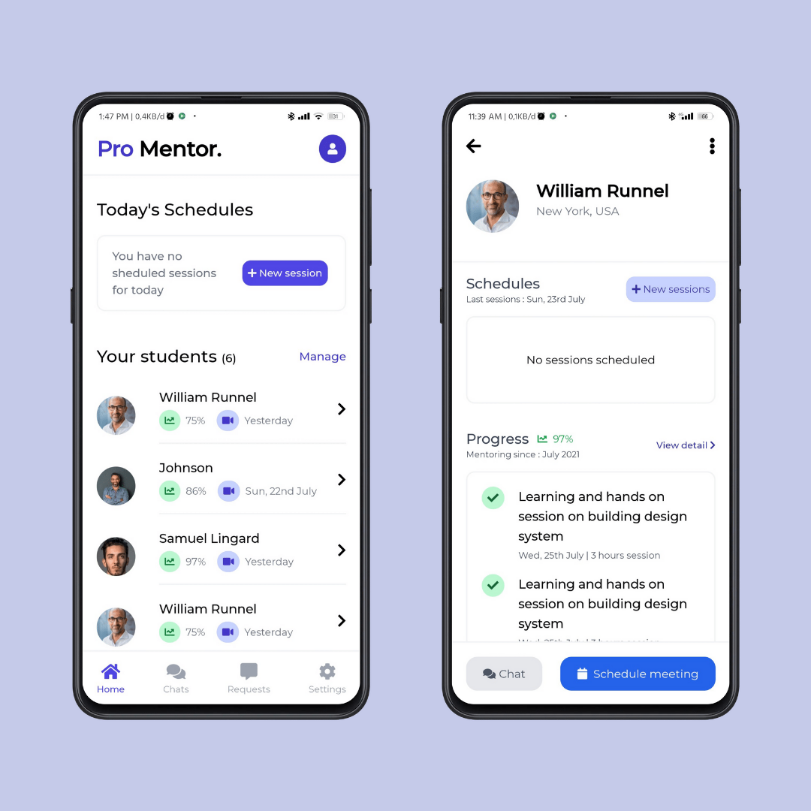

<h3 align="center">Scheduled App</h3>

Slicing project #07

### About
This is my projects to make UI using front end tech 

Where the ideas and the concept i use from any other designer UI/UX from Instagram or Dribbble

### Original design
by [@gouthamgtronics](https://www.instagram.com/gouthamgtronics/p/CYq1iJqFakO/?utm_medium=copy_link)

### Languages and Tools
- Vue Js 3
- Tailwind
- Vue Router
- Google Font Montserrat
- FontAwesome
- Termux
- Vite Js
- Acode code editor

### Clone This Repo
- <code>git clone https://github.com/or-abdillh/Todo.git </code>
- <code>cd Todo</code>
- <code>npm install</code>
- <code>npm run dev</code>

### Demo 
- [Scheduled App](https://scheduled-app.vercel.app/)

[Oka R Abdillah ](http://github.com/or-abdillh)
 
Last edited on : 22/01/2022